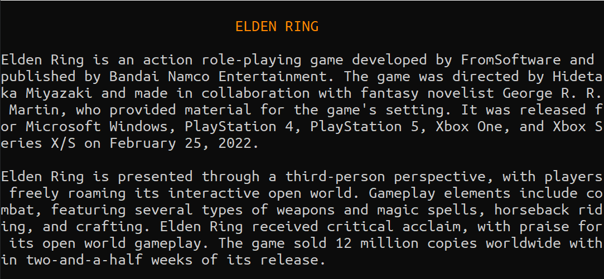
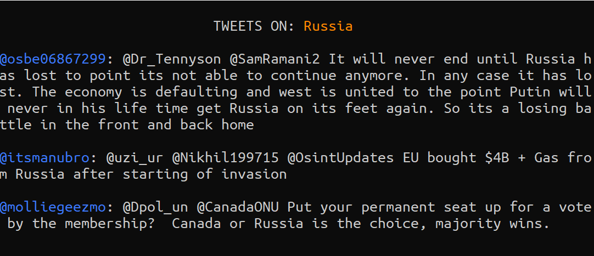

# Lyza - Speech Assistant

Lyza is my own personal assistant that helps me with my day-to-day life. It makes use of Google's Text-To-Speech API to scrape the web, find the definition of many terms on Wikipedia, check what is trending on Twitter, and open YouTube on its own. I hope that by the time this project comes to an end it will be capable of much more.
As of now, I am focused on developing the user's interface, so they can communicate with Lyza.

## Voice Commands

Before anything else, you need to **activate** Lyza's functions and awake it from its sleep! Simply say "*Hi Lyza*" to do so after you run the program.
You can command Lyza to get Wikipedia's definition for a particular word by saying: "Search, *word*".

You may also ask it to scrape the tweets that are trending related to a particular topic when proclaiming: "Trending, *topic*".

